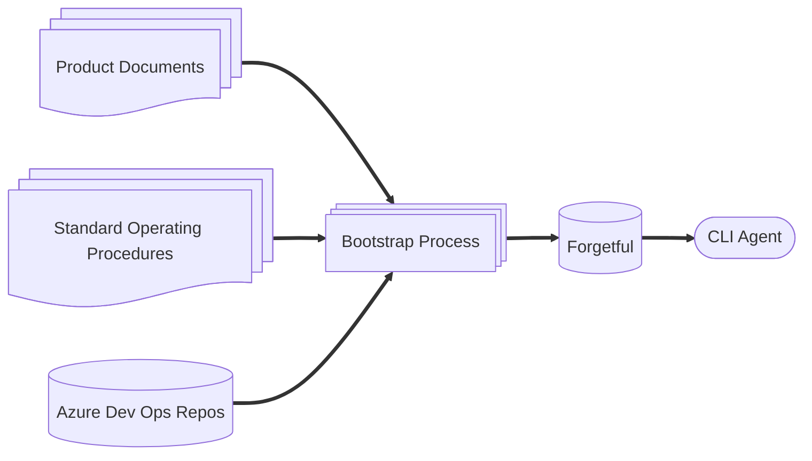
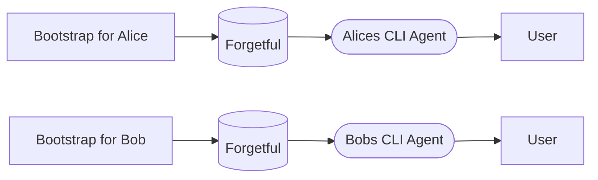
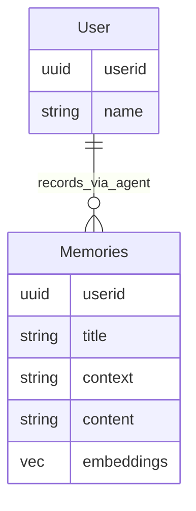
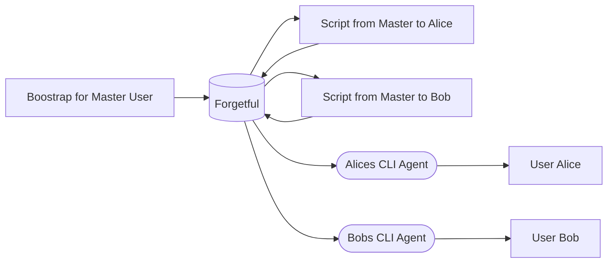

# Organisational Knowledge and Forgetful

## Introduction
When i built forgetful, i did so with the invidual user in mind. I wanted to give my agents
the ability to recall context from outside of the current session over a range of information relevant to me. 

When i was soley using forgetful in my personal life this was fine, however a friction soon emerged when 
it came to using it professionally. 

For my agents I use at work, connected to a secure instance of forgetful, i encoded a significant amount of 
my organisations knowledge in domains relevant to myself. The source of this knowledge came from various locations you might expect knowledge and information to come from; source code repositories, documents, sharepoints etc.

On the back of this i was able to have my agents perform complex tasks that required domain knowledge that would
be difficult to pull together using a straight forward RAG or Agentic Search approach, this helped me in a myriad of ways from simple bug hunting, to answering questions about products, updating documentation, to even some really complex gap analaysis and requirement building on an architecture that spanned over 100 repositories and mountains of product documentation. 

In order to encode that knowledge from these sources, and perhaps more importantly, to ensure that the knowledge base is kept up to date when those sources are updated. I built a bootstrapping process, that would loop through the source material and encode any deltas since the last run (or all of it if it is a first time run). The encoding involved spinning up headless cli agent instances using my [agent-shell](https://github.com/ScottRBK/agent-shell) libary with specialised encoding prompts. The agent would record memories of the sources, and also recorded entities and projects based on them. 

Those encoding prompts included information such as C4 Diagrams, component squad ownership to help ground the agent when it came to encode a source as to where that source sat in the overall context of the organisation. This is not a straight forward undertaking and I think the role of Knowledge Architecture for organisations will, if it is not already, going to become a key one in the future, due to the old computer adage, garbage in, garbage out. 

_Figure 1.1 - Boostrapping Process_

It was a great success for me, to the point whereby colleagues of mine would come to me and start asking 
"Can you just ask your AI...". Not just engineers, but other colleagues working in areas such as Application Support or Product Management. Naturally me being a bottleneck or gatekeeper of some kind of institutional oracle does not make sense. I wanted a means to be able to let colleagues query the knowledge base themselves. 

One option would be for me to share my bootstrapping process and let other users encode their own instance of Forgetful. Given that this involves spending tokens, this seems rather wasteful.

_Figure 1.2 - Multiple Forgetful Instance_

Forgetful does support multitenancy, so another option might be to host a single instance of Forgetful and have all users connect to that instance. There is one problem with this approach however, consider Forgetfuls Entity Relationship for users and memories:

_Figure 1.3 Forgetfuls User Memory Isolation_

Memories, and indeed all entities, have role based security applied for user isolation. This means that Alice cannot see Bob's memories and vice-versa. Given this constraint, we'd have to either still have to boostrap for each user, or perhaps a more cost effective, albeit cumbersome, approach would be to have an additional process that enriched users memories from a master user of some kind.

_Figure 1.4 - Multitenant Forgetful Instance, scripting knoweledge for ecah user from a master boostrap_ 

To this end I have been considering introducing a new feature to Forgetful to allow for enitiy security to also incorporated where within an organisation a user sits, we'll discuss that next.

## Feature Requirement

At a very high level we want to offer the ability for a user of the system to essentially two sets of information.

* Their own personal information and knowledge
* Information and knowledge for their organisation that they are entitled to access

In addition to this we want to be able to ensure that we are able to define which users are able to update information at their appropriate organisaitonal level. 

I am not sure how we want this currently, as things standard right now we do not ship a UI with forgetful, however long term i am envisaging a possible feature / solution whereby users can submit requests to update existing organisational knowledge because they have verified it to be inaccurate and a system admin can review the request and accept the change.

### Considerations on Requirements

One area i am still debating is how we manage organisational structure, do we have a simple Organisation ID and perhaps Team ID mapping on User, and a relationship between teams and organisations? Do we have something more elaborate like a self-referencing table which allows the construction of an organisational tree? Perhaps some other options? We need to ensure we are mindful of performance and compelxity with whatever our decision is on this particular matter.

## Non Functional
Following the change the product must have the following behaviour:

* Remain secure, we must continue to ensure we do not contaminate memories across users unless it is part of organisational knowledge and they are entitled to access it based on that organisational hierarchy.

* Must not introduce a new bottleneck for CRUD operations, right now the embedding and vecotr components are the bottleneck and this is to be expected as that is where the expensive ML compute is, however we do not want to introduce any noticeable delays on what we right now for CRUD operations.  

